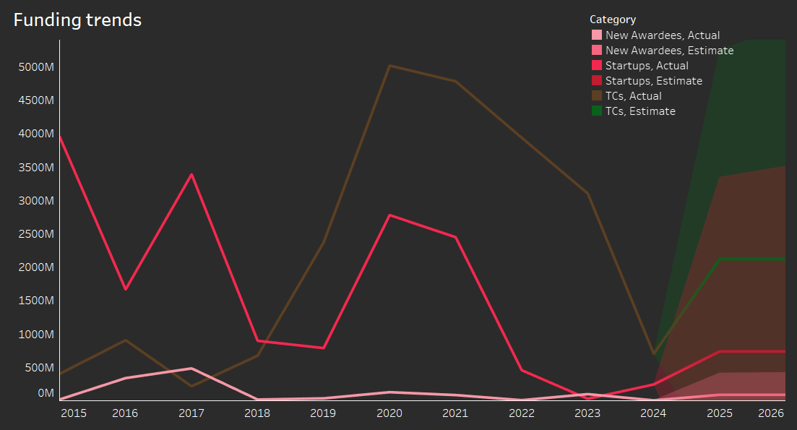
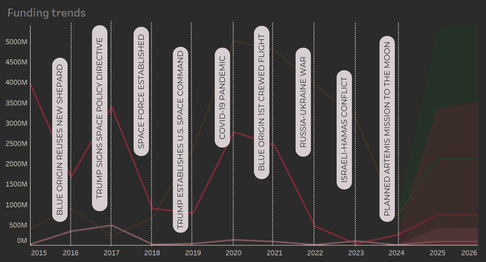
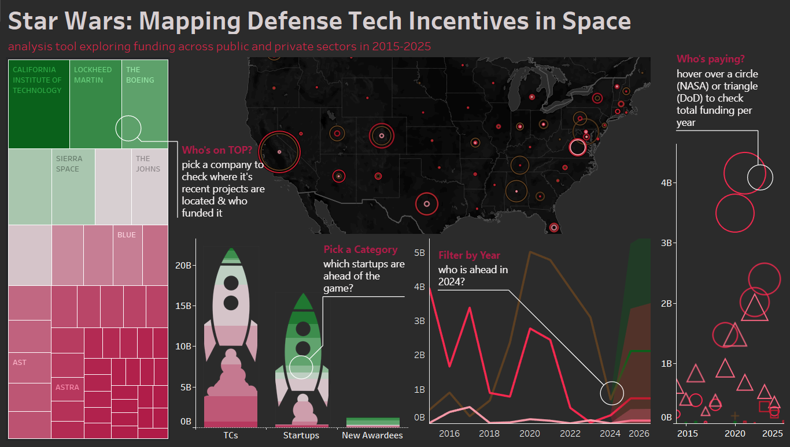
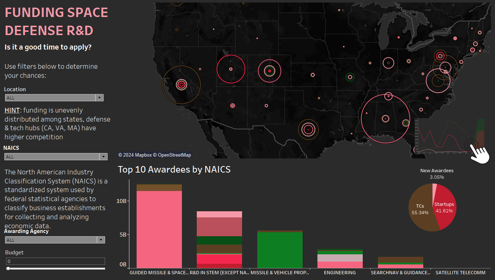

# Star Wars: Mapping Defense Tech Incentives in Space

## :dart: Project/Goals

Early space tech research goes way back to late 50's. Sputnik signaled the start of Space Age. In the U.S., early space militarization concentrated on nuclear-space link and leveraging orbit for strategic surveillance and early warning systems (which lead to first ASAT campaigns).

What happens to space tech in the following decades? The 1967 Outer Space Treaty doesn't forbid conventional weapons; Strategic Defense Initiative turns towards space-based missile defense systems (1983); Gulf War demonstrates the value of space-based assets - imagine, we can analyze movement of troops via satellites! Finally, establishment of US Space Force marks a brand new era.

We are witnessing a shift to public-private partnerships in space. Private companies are taking over what was once considered a government domain. Recent issues with the Boeing Starliner demonstrate this trend. SpaceX intends to assist NASA in arranging the return of ISS astronauts Sunita Williams and Butch Wilmore. Technical concerns led NASA to select SpaceX's Crew Dragon capsule instead of Boeing's Starliner.

It all brings us to the link between these questions [^1]: 
Is space being weaponized?
Who builds tech?
Who funds it?

We keep hearing on the news, that defense sector is increasingly investing in space technologies through new startups. But is that true?

To verify this, I used Crunchbase API for gathering data on startups and accessed US Spending award dataset to compare funding trends in both. I came up with two hypotheses to guide me:

1. Despite the increase in VC funding for space startups, traditional contractors continue to drive innovation and win bigger government contracts
2. US government increasingly favors startups over established contractors

**GOALS:**
#1. support financial decision making for new companies in defense sector;
#2. help scholars and government officials understand the funding distribution;
#3. answer the question: is US government giving preference to new companies in space defence sector in the past decade?

Core submitted files include:

- [x] README file
- [x] transformed and raw data files in csv format
- [x] python notebooks
- [x] a presentation (in pdf)
- [x] Tableau workbook (with dashboard and story presentation)
- [x] related images and static visualizations

## :art: Process

- **Raw data collection** (skills used: APIs, ODM):
    - creating requests from Crunchbase API to gather startup data
    - downloading defense contract data from USA Spending or other government sources (format: csv)

    :pushpin: **JUMP TO:** [accessing API](https://github.com/ankamercier/capstone_project/tree/main/src/accessing_api)

- **Data cleaning and preprocessing** (skills used: Pandas):
    - connecting startup data with defense contractor data (use the company name as the primary key to connect datasets)
    - standardizing company names across datasets
    - handling missing values and outliers

    > For Crunchbase data, I performed additional steps:
    > - converted date fields to a consistent format
    > - extracted year from 'founded_date'
    > - categorized companies based on 'Industries'
    
    > For USA Spending data:
    > - filtered out irrelevant awards
      
   :pushpin: **JUMP TO:** [cleaning data](https://github.com/ankamercier/capstone_project/tree/main/src/cleaning_data)

- **Merging Data** (skills used: Pandas):
    - creating a common key for merging based on standardized company names
    - using fuzzy matching to connect Crunchbase and USA Spending data
    - creating a merged dataset with relevant columns from both sources

    :pushpin: **JUMP TO:** [merging data](https://github.com/ankamercier/capstone_project/tree/main/src/merging_data)

- **Exploratory Data Analysis [EDA]** (skills used: Pandas, Seaborn):
    - analyzing funding trends, contract distributions, etc.
    - correlations (looked for overlaps between startups receiving funding and those winning defense contracts)

    :pushpin: **JUMP TO:** [EDA](https://github.com/ankamercier/capstone_project/tree/main/src/eda)

- **Model building**
    - this was a "stretch" exercise

    :pushpin: **JUMP TO:** [EDA](https://github.com/ankamercier/capstone_project/tree/main/src/model_building)

-**Modifying data for Tableau**

- **Dashboard creation** (skills used: Tableau):
    - using Tableau to create an interactive dashboard
    - connecting datasets  
    - included: 
         - geographic distribution of companies and "space warfare" funding
         - separate interactive dashboard for potential contractors
         - trend analysis of funding distribution among traditional contractors, new awardees, and startups over time
         - technology focus areas receiving the most funding (e.g., satellite systems, propulsion, missiles)

    :pushpin: **JUMP TO:** [Tableau workbook](https://github.com/ankamercier/capstone_project/tree/main/results/space_defense_workbook)

- **Interpretation and insights:**
    - creating a story to summarize findings
    - drawing conclusions about the relationship between startups, traditional contractors, and defense funding in the space warfare domain

  :pushpin: **JUMP TO:** [Tableau Story](https://github.com/ankamercier/Analyzing_Airbnb_In_Tableau/tree/main/results/space_defense_story)

## Results

I analyzed 3 groups: Traditional Contractors, Startups founded between 2015 and 2024, and New Awardees - which are essentially startups that signed a government contract within the past decade. 

> [!IMPORTANT]
> US government alone invested $22.15 billion in space-related projects over the past decade.
> Only 5.22% of contracts were granted to New Awardees, compared to conventional defense contractors in the same timeframe.

The key line chart below shows funding trends within 2015-2025.

Light pink line on the bottom allows us to reject the 2nd hypothesis: the peak in funding for New Awardees in 2017 suggests a shift towards emerging technologies that later flattens out. Take a look at how favorable conditions for startups that year contrasted with challenges faced by traditional contractors. 

Let's focus on a brown line now. Spike in 2020 was likely due to pandemic, as everyone prioritized national security due to global uncertainty. Dip in '23 could be due to defense priorities and budget reallocations (decommission of ISS and pivoting into commercial space travel is my guess).

Now take a look at VC funding volatility. This can be linked to changing investor confidence and geopolitical events. We see interest in 2017 and 2020, then economic uncertainty and shift in investment strategies, with slight recovery this year as confidence returns.

Below I added some key events in the past decade that might've influenced the volatility (this is not a result of correlation/causation modelling or attempt to explain data outcomes by events - it's purely informational, please investigate it further and draw your own conclusions):

Main dashboard provides a more advanced overview of the sector:
- with a treemap, you can pick a company to check where it's located and who funded it
- pick a category under the rockets to see who is ahead of the game
- filter by year on our line chart
- hover over NASA or a DoD to check total funding per year

We can partially accept our first hypothesis: while there has been no increase in VC funding (in general high volatility, with total funding of 44.6% compared to Traditional Contractors), TCs still lead the way. DoD must streamline its procurement and acquisition policies if the US wants to stay ahead of its adversaries in coming years.

As of my second hypothesis, we can easily reject it. US government is not giving preference to new companies in space defence sector in the past decade.

Government is not diversifying it's contractors.

There is a shift from government-dominated to private incentives in space. It does not, however, mean that there are more public-private partnerships in space. Nor that government choses new businesses over traditional contractors. 

We do see examples of it. But it's not a trend just YET.

Private space activities were defined 40 years ago by the US Commercial Space Launch Act. It allowed SpaceX and Blue Origin to become leaders in space launches by lowering costs and increasing flight frequency. 

While defence giants like Boeing or Lockheed are still on top, startups moving into space domain are no longer happy to just get a small piece of pie. 

They now have a HALF OF IT.

### Created visualizations:

**1. Interactive Maps**
 **Details**: I created two maps for 2 separate dashboards. 

The first one reflects summary of all funding in the past decade (both public and private), with location of recipients from all 3 categories serving as a geographic dimention in Tableau. I included total funding and competition (number of companies in particular state).

Second map is dedicated for future award recipients and is aimed at supporting their R&D decision making with regards to public funding. Map includes only public awards with average funding amount and competition in each state. I created calculated fields and parameters, which allow to filter the results by state, North American Industry classification System (NAICS) code, agency, and award size. I also created a dedicated dashboard that can serve as a roadmap for future award recipients:

**2. Line Chart**
 **Details**: this is by far the most important visualization in this project. It shows funding trends within the past decade.

**3. Stacked Bar Charts**
 **Details**: First stacked bar chart shows how funding in each category was distributed by year, second visualizes top 10 awardees by NAICS.

**4. Treemaps**
 **Details**: I chose my first treemap to represent industries that startups come from, leading by aerospace and AI. Second treemap shows top companies overall - I used it in my main dashboard to show top companies after applying filters such as category, year or awarding agency.

**5. Bubble chart**
 **Details**: this chart had to initially become a "galaxy" with planets instead of data points, but (gladly) esthetics won over sophistication ;) It shows agencies that provided funds to our companies.

**6. Pie chart**
 **Details**: serving as a simple summary, this pie chart shows a percentage of funding across our 3 categories: Traditional Contractors, New Awardees, and Startups.

### Based on above mentioned visualizations and EDA, I was able to answer following questions:

**1. Is it a good time to apply for public funding?**
 Answer: There are various nuances of course, most importantly R&D funding is highly competitive. But there are simple questions that we can answer on R&D dashboard using filters such as location, industry code, awarding agency or budget we require. Using data from the past decade, we can aid decision-making for future entrants.

Note that while we can see evident 'hubs' in California and around DC, there is significant funding stream in unpredictable locations, such as Utah. It might be a sign that there is less competition there. 

We can also see that missiles were significantly more 'popular' than satellite telecom, which seems to be a viable direction for a defense startup (but of course further trend analysis and domain knowledge is required).

**2. Is US government giving preference to new companies in space defense sector in the past decade?**
 Answer: Despite the news and promises that presidential candidates gave in the past, data shows that public funds that go towards new companies are barely noticable considering the full scale of defense budget. It would be interesting to analyze lobbying activities and gather further evidence of these false claims as a follow-up to this research. 

**3. Does private sector stand a chance against the military-industrial complex?**
  There has been evidence that VC funding was once higher that public funding in this niche (in 2017) - overall data for the past 10 years shows that public vs private investments amount to nearly 50/50 proportion, and considering the fact that space was exclusively under government "jurisdiction", fast-paced shift towards private money gives a good outlook for the next century and beyond. 

You are welcome to play around - here's the link to Tableau workbook.

## :medal_sports: Skills & Methods used
- Raw data collection and API access
- Data cleaning and preprocessing
- ETL techniques for data transformation (using Pandas)
- Exploratory Data Analysis (EDA)
- Data visualization
- Tableau Public

## :construction: Challenges 
- restrictions in access to commercial API
- smart data merging, to avoid duplicates (had to re-visit EDA)

## :rocket: Future Goals
Explore correlations between lobbying and success of contractors, cross-check companies in OCIJ Paradise Papers database (is there a correlation in number government contracts between contractors that had offshore shell companies in the past, and those that didn't?). 

I'd like to access the GDELT dataset and use it to identify significant events that might correlate with fluctuations in defense funding trends [STRETCH ACTIVITY]. I could also use a more stable and well-documented API for global events data, such as the [ACLED](https://acleddata.com/conflict-index/) (Armed Conflict Location & Event Data Project) API.

Also, someone has to make that "galaxy" bubble chart we all deserve, with planets instead of data points :sparkles:

> [!NOTE]
> Here's a link to [Tableau Public](https://public.tableau.com/views/space_defense_workbook/Story?:language=en-US&:sid=&:redirect=auth&:display_count=n&:origin=viz_share_link)

[^1]: Disclaimer: this assignment is part of a Capstone Project at Lighthouse Labs 
